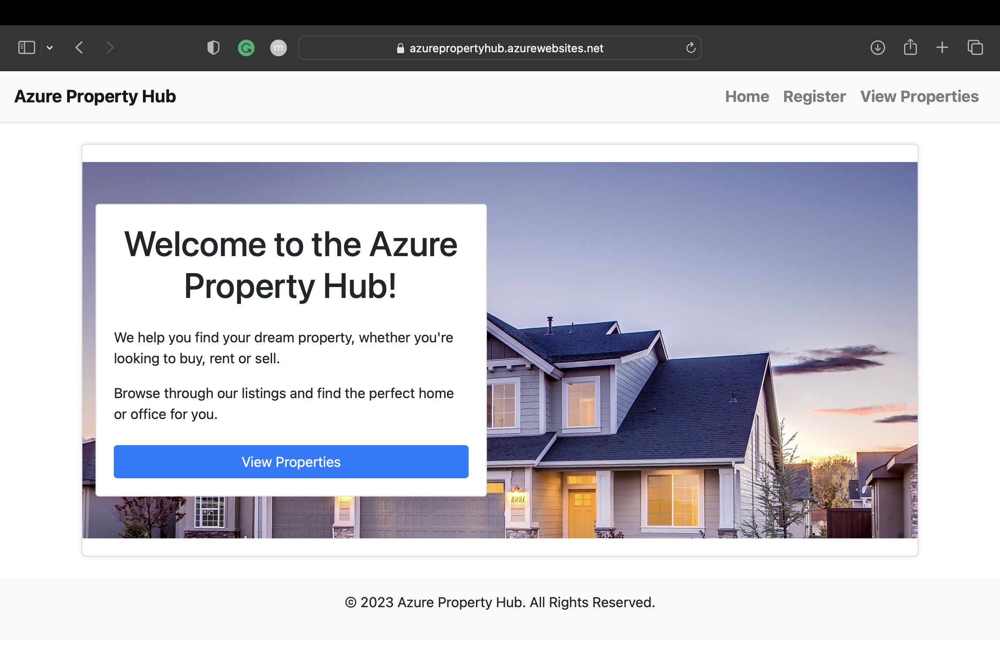

# Django Property Management App on Azure

Available on Azure at [Azure Property Hub](https://azurepropertyhub.azurewebsites.net)

This repository contains the source code and configuration files for Azure Property Hub, a Django-based web application that allows users to create and manage property listings. The app uses Bootstrap for the front-end design and Django REST framework for the API.

## Features
* User authentication and authorization
* User password reset and recovery
* User roles and permissions for admin, editor, and viewer
* Creation, editing, and deletion of property listings
* Admin dashboard for property management including photo upload
* Azure Blob Storage for media files
* Responsive design using Bootstrap for better mobile viewing

## Getting Started
To run Azure Property Hub locally, you need to follow these steps:
1. Clone this repository to your local machine.
2. Install the necessary dependencies by running `pip install -r requirements.txt`.
3. Set up your local database by running `python manage.py migrate`.
4. Create a superuser account by running `python manage.py createsuperuser`.
5. Run `python manage.py runserver` to start the development server.
6. Load initial data (optional) by running `python manage.py loaddata data.json`.

## Contributing
Contributions to this project are welcome. If you find a bug or have a feature request, please open an issue. If you want to contribute code, please fork the repository and create a pull request.

## License
This project is licensed under the MIT License. See the [LICENSE](LICENSE) file for more information.